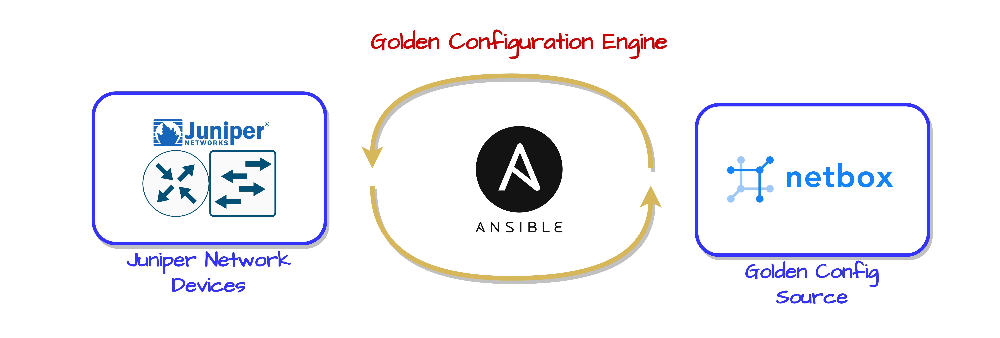

# golden-config-engine
Enforce intended network state using ansible and a rendered golden configuration template

--- 

The purpose of this repository is to provide a production-ready ansible process which standardizes system configuration on Juniper switches and routers.

Related Blog Post can be found here: https://kaonbytes.com/p/golden-configuration-deployment-with-ansible-and-netbox/

The Steps:
  - Populate central Source Of Truth (SoT) with desired system variables and config context. **Netbox** is the preferred system.
  - Populate Ansible Vault, or some other credential manager with secrets
  - Render desired configuration with jinja2 templating
  - Create idempotent secret keys from passwords ($1, $5, $6, $9 keys) in the configuration using custom filter.py functions
  - Deploy desired configuration with Ansible junos_config module using the **replace** argument
  - Use the the Junos built-in **commit_check** fucntion to perform dry-runs. This allows for compliance checking without automatic enforcement 

  
